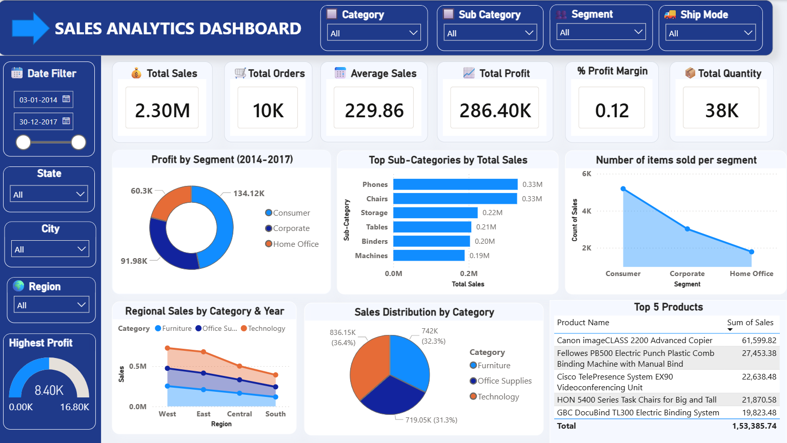

📊 Sales Analytics Dashboard — Power BI

📌 Overview
An interactive Sales Analytics Dashboard built using Microsoft Power BI, analyzing over $2.30M in total sales across 4 regions, 3 customer segments, and multiple product categories between 2014 and 2017.
This project demonstrates skills in data visualization, DAX measures, and business intelligence storytelling using a real-world retail dataset.

🚀 Key Metrics
Metric
Value
Total Sales
$2.30M
Total Orders
10K
Average Sales
$229.86
Total Profit
$286.40K
Profit Margin
0.12 (12%)
Total Quantity Sold
38K

📊 Dashboard Features
KPI Cards — Instant view of Total Sales, Orders, Profit, and Quantity
Dynamic Slicers — Filter by Category, Sub-Category, Segment, Ship Mode, State, City, and Region
Date Range Filter — Analyze any custom time period between 2014–2017
Profit by Segment — Donut chart comparing Consumer, Corporate, and Home Office
Top Sub-Categories by Total Sales — Horizontal bar chart ranking product sub-categories
Number of Items Sold per Segment — Area chart showing volume distribution
Regional Sales by Category & Year — Area chart across West, East, Central, South
Sales Distribution by Category — Pie chart of Furniture, Office Supplies, Technology
Top 5 Products Table — Ranked by revenue with exact sales figures

💡 Key Insights
See INSIGHTS.md for detailed business findings.
🛠️ Tools & Technologies
Microsoft Power BI Desktop
DAX (Data Analysis Expressions) for calculated measures
Power Query for data transformation
Dataset: Sample Superstore Dataset (Kaggle)

📁 Project Structure
Code

📂 Dataset
Source: Sample-Superstore Dataset — Kaggle
Records: ~10,000 orders
Period: 2014–2017
Fields: Order ID, Product, Category, Sales, Profit, Region, Segment, Ship Mode, and more

🎯 Skills Demonstrated
Business Intelligence Dashboard Design
DAX Measure Creation
Data Cleaning & Transformation (Power Query)
Visual Storytelling with Data
KPI Tracking & Performance Analysis
Regional & Segment-level Analysis

👤 Author
Bandi Nithya Sai Santhoshini
GitHub: @Nithya-2912
LinkedIn: https://www.linkedin.com/in/nithya-sai-santhoshini-bandi-14643637a/

⭐ If you found this project useful, feel free to star the repository!

